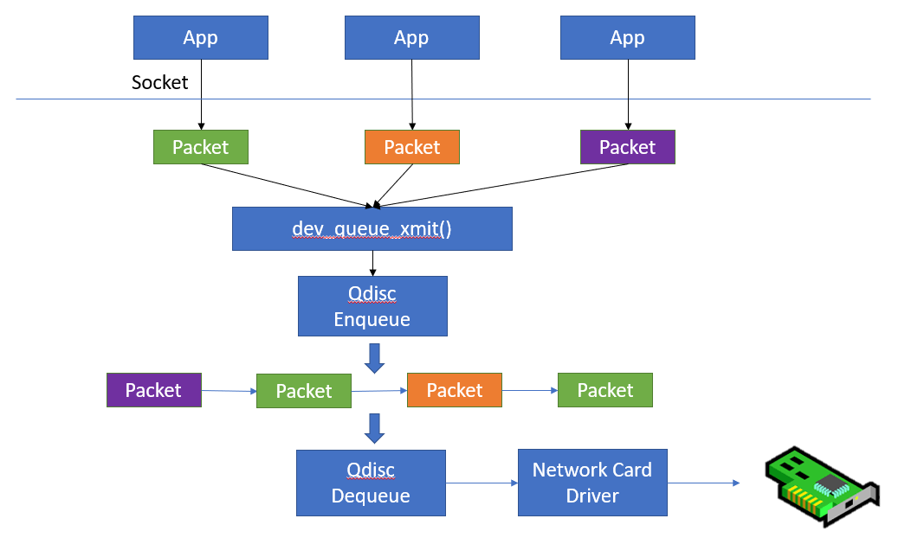
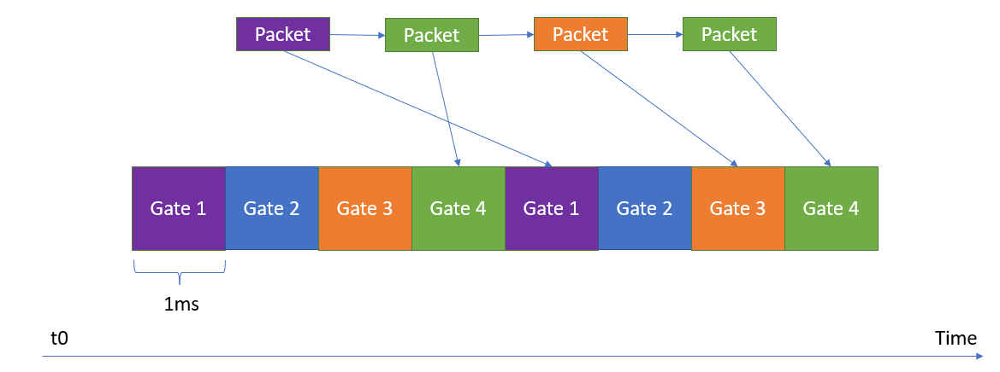

# Ixia Challenge 2023

## TSN - Time Sensitive Networking

TSN is a technology that started to receive more and more attention from networking engineers as it guarantees determinism and ensures stable throughput in Ethernet networks. But accomplishing time synchronization between two or more endpoints is not an easy thing, not when dealing with time critical communications where nanoseconds precision is required.

In this Ixia Challenge we will be looking at some of the problems which TSN networking tries to solve and get familiar with basic TSN concepts.

## Qdisc support for TSN in Linux

### What is a Qdisc?

The Qdisc (Queueing Discipline) is the support in the Linux kernel for buffering, classifying and scheduling outgoing network packets before the packets are sent to the network driver.

In the above picture we can see different applications using the networking support offered by the Linux kernel through the use of network sockets. Each network packet will be handled by the Enqueue function of the Qdisc, and can be immediately transmitted to the network card by the Dequeue function or can be buffered and processed more by the Qdisc implementation.

The Qdisc is also responsible for retrying to enqueue the network packet inside the network cards transmission rings, in case the rings are full and there is no room for more packets in the network card.

The simplest Qdisc example might be the [blackhole ](https://elixir.bootlin.com/linux/latest/source/net/sched/sch_blackhole.c)Qdisc, which drops every packet sent by the network stack.

### The ETF and TAprio QDiscs

The [ETF ](https://man7.org/linux/man-pages/man8/tc-etf.8.html)(Earliest TxTime First) and the [TAprio ](https://man7.org/linux/man-pages/man8/tc-taprio.8.html)(Time Aware Priority) Qdiscs are mainly used in TSN setups, where a packet needs to be sent at a precise time. The moment when the packet is transmitted is important in order to meet the timing requirements of that network.

For example, one TSN protocol is 802.1Qbv time-aware shaper, which classifies the packets based on a priority and a Gate (as in window of time) in which the packet can be transmitted.

A certain packet can be sent only in its specific Gate open duration. If a packet has missed its window opportunity, it has to wait for the next Gate to open.

## Challenge

Will be displayed on Saturday, May 27, 2023.

### Challenge 1: Audio-Video Streaming

Will be displayed on Saturday, May 27, 2023.

### Challenge 2: Reordering Incoming Streams

Will be displayed on Saturday, May 27, 2023.

## Building

sudo apt install gcc make -y

make

sudo insmod ixia_challenge.ko

### Inserting the Qdisc

iface=eth1

sudo tc qdisc replace dev "${iface}" root ixia_qdisc

### Check if the new qdisc was inserted properly

tc qdisc show

